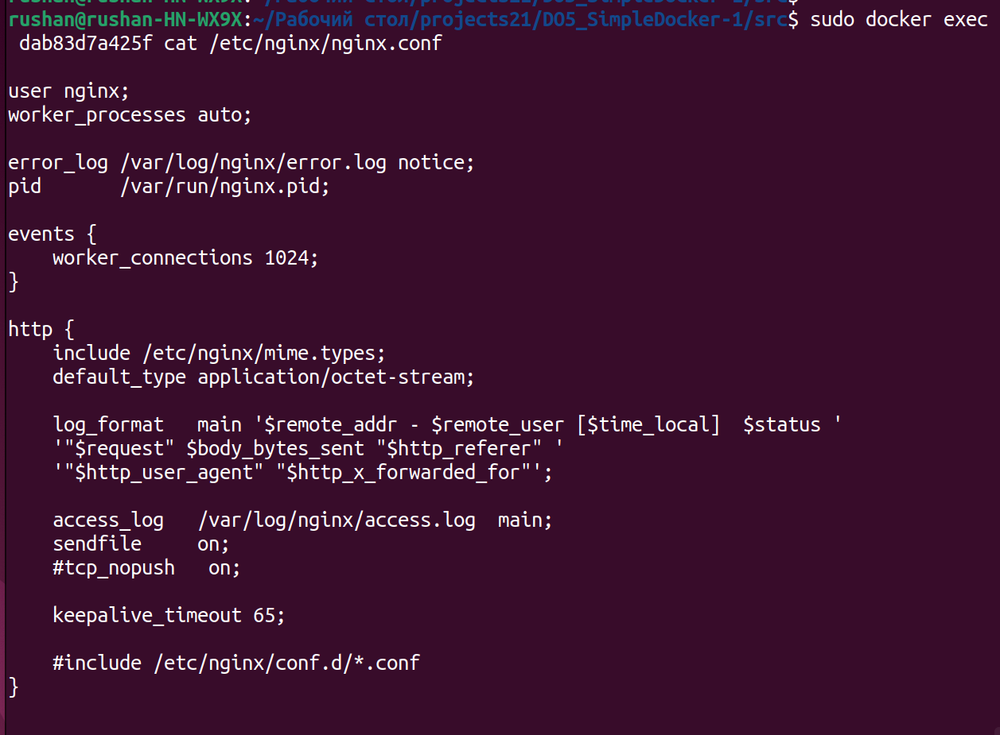
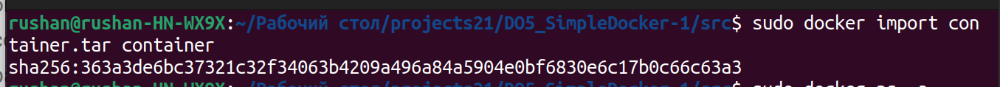
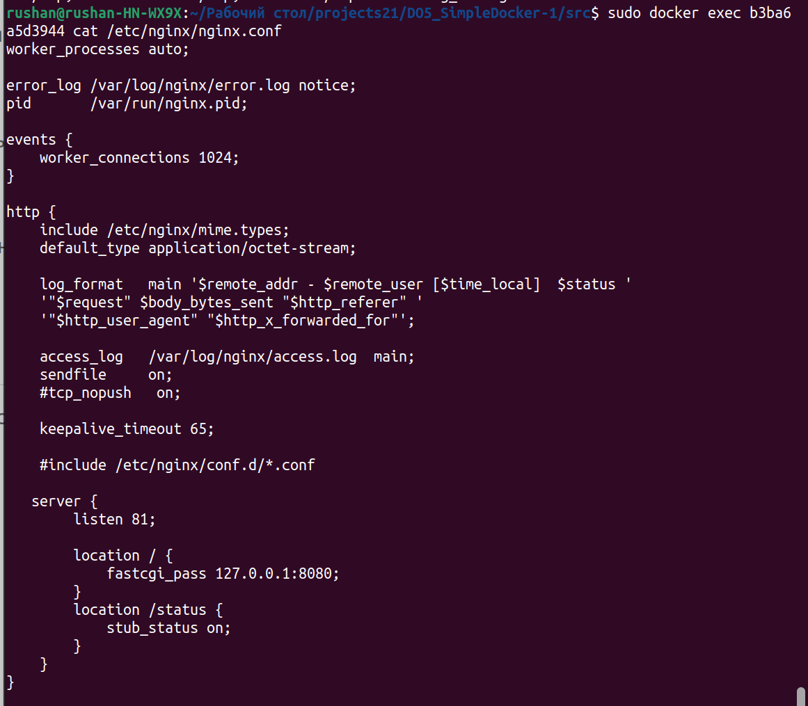
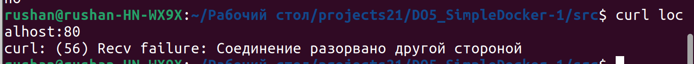
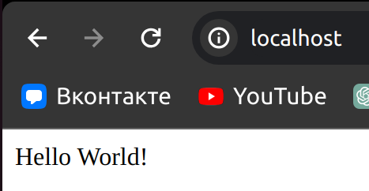

# Отчет по работе Do5 SimpleDocker

## Part 1. Ready-made docker

Первый пункт я делал на виртуалке(ко второму пункту я проделал все необходимые операции отдельно тоже)

##### Возьмём официальный докер-образ с nginx и выкачай его при помощи docker pull:

docker pull nginx

##### Проверяем наличие докер-образа через docker images:

result docker images

##### Теперь запускаем докер-образ через docker run -d [image_id|repository]:

docker run and images

##### Проверяем, что образ запустился через docker ps.

checking docker ps

##### Посмотрим информацию о контейнере через docker inspect [container_id|container_name].

##### По выводу команды определим и поместим в отчёт размер контейнера, список замапленных портов и ip контейнера.

container size

SizeRootFs: the total size of all the files in the container, in bytes.
SizeRw: the size of the files that have been created or changed in the container, compared to it's image, in bytes.

list of mapped ports

container IP

Здесь IPAddress - IP контейнера

Размер контейнера - 186722098 байт

Список замапленных портов - "80/tcp: null"

ip контейнера - 172.17.0.1

##### Останавливаем докер образ через docker stop [container_id|container_name].

##### Проверяем, что образ остановился через docker ps.

command docker stop and check docker ps

##### Запускаем докер с портами 80 и 443 в контейнере, замапленными на такие же порты на локальной машине, через команду run.

run docker 80:80 and 443:443

Так как я первый пункт делал на виртуалке, то, естественно, там стоит linux бег GUI и я решил поставить себе текстовый веб-браузер:

sudo install links

##### Проверим, что в браузере по адресу localhost:80 доступна стартовая страница nginx:

Командой links http://localhost:80 или просто localhost:80:

nginx start page

##### Перезапускаем докер контейнер через docker restart [container_id|container_name]:

docker restart

##### Проверяем любым способом, что контейнер запустился:

check that the container is running

###### *Для сравнения просто файл nginx.conf на виртуалке:

nginx.conf on virtual machine

## Part 2. Operations with container

##### Прочитай конфигурационный файл nginx.conf внутри докер контейнера через команду exec

docker exec cat

##### Создаём на локальной машине файл nginx.conf и настраиваем в нем по пути /status отдачу страницы статуса сервера nginx.

edit nginx.conf

##### Скопируем созданный файл nginx.conf внутрь докер-образа через команду docker cp.

##### Перезапускаем nginx внутри докер-образа через команду exec.

cp nginx.conf and nginx reload

##### Проверяем, что по адресу localhost:80/status отдается страничка со статусом сервера nginx.

localhost:80/status(1)

##### Экспортируем контейнер в файл container.tar через команду export и останавливаем контейнер.

export and docker stop

##### Удаляем образ через docker rmi [image_id|repository], не удаляя перед этим контейнеры и проверяем images:

docker rmi and checking docker images

##### Удаляем остановленный контейнер.

delete container

##### Импортируем контейнер обратно через команду import.

attempt to import

check image after import

Команды import и export вообще не предназначены для переноса контейнеров целиком. это только файловая система. для контейнеров есть save/load. но поскольку у нас тут выбора нет - надо учиться восстанавливать настройки для хоть минимальной работоспособности

Для запуска не хватает как минимум CMD и по желанию ENTRYPOINT

Просматриваем nginx.conf у сервера nginx

nginx CMD

Копируем эти строчки в import и пытаемся снова заимпортить

fixed import with CMD

##### Запускаем докер-образ через docker run -d [image_id|repository] и проверяем командой docker ps:

docker ps after import

Контейнер запустился и появился в списке, импорт прошел удачно.

##### Проверяем, что по адресу localhost:80/status отдается страничка со статусом сервера nginx.

curl localhost:80/status after import

## Part 3. Mini web server

##### Напиши мини-сервер на C и FastCgi, который будет возвращать простейшую страничку с надписью Hello World!

server C fastcgi

Компилируем написанный нами сервер:

compile server

##### Запускаем написанный мини-сервер через spawn-fcgi на порту 8080:

spawn-fcgi

##### Напишем свой nginx.conf, который будет проксировать все запросы с 81 порта на 127.0.0.1:8080:

nginx.conf

Исходник файла я взял прямиком с nginx, который был на докере, исправил только блок server и после изменения выполнил команду:

Сначала полностью перезапустил службу nginx:

nginx restart

После этой команды на всякий случай еще раз выполню эту команду(она заодно и проверит, что .conf записан правильно):

nginx -s reload

##### Проверяем, что в браузере по localhost:81 отдается написанная тобой страничка.

Прямиком из терминала:

in terminal localhost:81

Теперь в браузере непосредственно на локальной машине(Google Chrome):

Chrome localhost:81

##### Положим файл nginx.conf по пути ./nginx/nginx.conf (это понадобится позже):

Так как для запуска мини-сервера я уже проделывал это действие на локальной машине, то закинем в докер:

cp nginx.conf

И проверим + перезапустим службу nginx командами nginx -s reload и nginx -t:

check nginx.conf on docker

## Part 4. Your own docker

##### Напиши свой докер-образ, который:

1) собирает исходники мини сервера на FastCgi из Части 3;

2) запускает его на 8080 порту;

3) копирует внутрь образа написанный ./nginx/nginx.conf;

4) запускает nginx.

DockerFile

##### Собери написанный докер-образ через docker build при этом указав имя и тег:

Docker Building

##### Проверь через docker images, что все собралось корректно.

check images

##### Запусти собранный докер-образ с маппингом 81 порта на 80 на локальной машине и маппингом папки ./nginx внутрь контейнера по адресу, где лежат конфигурационные файлы nginx'а

Docker Run

#### Проверь, что по localhost:80 доступна страничка написанного мини сервера.

localhost:80

#### Допиши в ./nginx/nginx.conf проксирование странички /status, по которой надо отдавать статус сервера nginx.

added /status in nginx.conf file

#### Перезапусти докер-образ.

Docker restart

Check nginx.conf on docker

#### Проверь, что теперь по localhost:80/status отдается страничка со статусом nginx

locahost:80/status

## Part 5. Dockle

Изначально пакета dockle нет, поэтому нужно найти "инструкцию" как установить его себе

gihub dockle install

Теперь копируем все строчки себе в терминал:

dockle install

#### Просканируй образ из предыдущего задания через dockle [image_id|repository].

First attempt Dockle(1)

First attempt Dockle(2)

#### Исправь образ так, чтобы при проверке через dockle не было ошибок и предупреждений.

Добавил изменения в DockerFile, предварительно я его сделал понятнее, правильнее и короче:

Changed DockerFile

Здесь я заккоментировал момент, который должен был сам избавить от предупреждения о пользователе, но в чем была прроблема:

Attempt to add user

Так как версия nginx не позволила мне нормально избавиться от одного WARN, то есть еще один способ избавиться от него:

Solve the problem with Warn CIS-DI-0001

##### В дополнение, вот что происходило, если создать пользователя, но не выдать ему достаточно прав:

Non root user without allows

## Part 6. Basic Docker Compose

##### Напиши файл docker-compose.yml, с помощью которого:

1) Подними докер-контейнер из Части 5 (он должен работать в локальной сети, т.е. не нужно использовать инструкцию EXPOSE и мапить порты на локальную машину).

2) Подними докер-контейнер с nginx, который будет проксировать все запросы с 8080 порта на 81 порт первого контейнера.

docker-compose.yml

Проксирование всех запросов с 8080 порта на 81 порт первого контейнера

nginx.conf for part6

#### Замапь 8080 порт второго контейнера на 80 порт локальной машины.

###### В строчке ports файла docker-compose.yml

#### Останови все запущенные контейнеры.

Checking actived containers

#### Собери и запусти проект с помощью команд docker-compose build и docker-compose up.

###### Ниже два скрина - собираем докеры

docker-compose build(1)

docker-compose build(2)

###### А теперь запускаем:

docker-compose up

#### Проверь, что в браузере по localhost:80 отдается написанная тобой страничка, как и ранее.

check localhost:80

###### Проверим заодно и /status:

check localhost:80/status